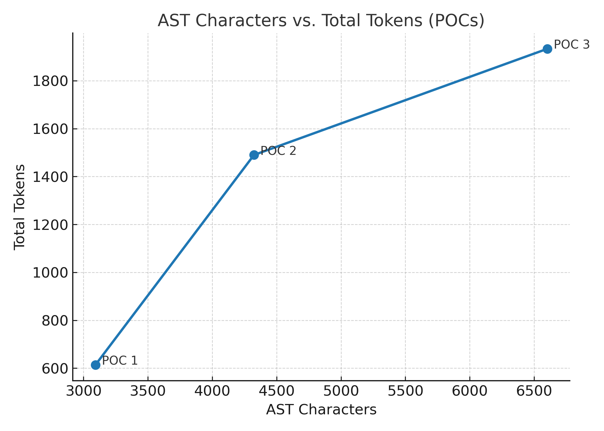

# AI Codebase Analyzer

An intelligent tool that leverages AI to understand, analyze, and modify large codebases using Abstract Syntax Trees (AST) for efficient code comprehension and targeted symbol retrieval.

## Features

- **AST-Based Analysis**: Uses Abstract Syntax Trees for precise code understanding and symbol extraction
- **Smart Symbol Querying**: Automatically identifies and retrieves only the most relevant code symbols for a given query
- **Project Summary Integration**: Uses a `bal.md` file containing project structure and file descriptions
- **AI-Powered Code Modification**: Employs OpenAI's GPT-4 to understand code context and make intelligent modifications
- **Step-Limited Processing**: Prevents infinite loops with configurable step limits
- **Efficient Token Usage**: Optimizes performance by querying only necessary AST nodes
- **Comprehensive Logging**: Built-in logging system for debugging and performance monitoring

## Prerequisites

- Bun (v1.0 or higher)
- OpenAI API key
- TypeScript support

## Installation

```bash
# Clone the repository
git clone https://github.com/yasithrashan/codebase-filter-tools
cd codebase-filter-tools

# Install dependencies
bun install
```

## Configuration

1. **Set up your OpenAI API key**:
   ```bash
   export OPENAI_API_KEY=your_api_key_here
   ```

2. **Create a project summary file** (`bal.md`):
   This file should contain your project structure and descriptions:

   ```markdown
   # Project Structure

   ## Main Application
   - `index.ts` - Main analyzer entry point and AST-based analysis functionality

   ## Authentication System
   - `auth.ts` - Core authentication functions and user management
   - `login.ts` - User login functionality and session management
   - `signout.ts` - User sign out process and session cleanup
   - `signup.ts` - User registration and account creation

   ## Configuration
   - `tsconfig.json` - TypeScript configuration
   - `package.json` - Project dependencies and scripts
   - `ast.json` - Generated Abstract Syntax Tree of the codebase
   - `logger.ts` - Logging utilities for debugging and monitoring
   ```

3. **Generate AST file** (`ast.json`):
   The tool requires a pre-generated AST of your codebase. This should contain the complete syntax tree structure of your project files.

## Usage

### Basic Usage

The analyzer uses AST-based symbol querying for efficient code analysis:

```typescript
// Main analyzer implementation
import { openai } from "@ai-sdk/openai";
import { generateText, stepCountIs, tool } from "ai";
import { z } from "zod";
import * as fs from "fs";
import { logToFile } from "./logger";

// QueryAST tool for symbol retrieval
const queryAST = tool({
  name: "QueryAST",
  description: "Retrieve AST nodes for specific functions, types, or exports.",
  inputSchema: z.object({
    symbols: z.array(z.string()).describe('List of function/type names to fetch'),
  }),
  execute: async ({ symbols }) => {
    // AST traversal and symbol extraction logic
  },
});
```

### Running the Analyzer

```bash
# Run the main analyzer
bun run index.ts

# Or use the shorthand
bun run .
```

### Example Queries

The tool can handle various types of code modification requests:

- **Authentication Enhancements**: "Modify the authentication system to add optional email support in signup, track the current user in login/signout, and add a simple resetPassword function"
- **Feature Additions**: "Add a new user role system with permissions"
- **Code Refactoring**: "Extract common validation logic into utility functions"
- **Bug Fixes**: "Fix the session timeout handling in the auth system"

## How It Works

1. **AST Loading**: The tool loads a pre-generated AST of your entire codebase
2. **Query Analysis**: The AI analyzes the user query to understand the required modifications
3. **Symbol Identification**: Identifies relevant functions, types, and exports needed for the task
4. **Targeted AST Querying**: Uses the QueryAST tool to retrieve only the necessary code symbols
5. **Code Generation**: Generates updated or new code based on the retrieved AST nodes
6. **Logging**: Comprehensive logging of the entire process for debugging and optimization

## Performance Metrics

The AST-based approach significantly improves token efficiency:

| POC   | AST Characters | Input Tokens | Output Tokens | Total Tokens |
|-------|----------------|--------------|---------------|--------------|
| POC 1 | 3,093          | 533          | 81            | 614          |
| POC 2 | 4,324          | 993          | 497           | 1,490        |
| POC 3 | 6,602          | 1,240        | 693           | 1,933        |

*Performance scales linearly with codebase size while maintaining efficient token usage*



## Configuration Options

### Step Count Limiting

```typescript
stopWhen: stepCountIs(15)  // Adjust based on query complexity
```

### Model Selection

```typescript
model: openai('gpt-4.1-mini')  // or 'gpt-4', 'gpt-3.5-turbo'
```

### QueryAST Tool Parameters

```typescript
symbols: ["functionName", "ClassName", "interfaceName"]  // Target specific symbols
```

## Architecture

### Core Components

- **AST Parser**: Processes and indexes the entire codebase structure
- **Symbol Resolver**: Maps function/type names to their AST locations
- **Query Engine**: Efficiently retrieves relevant code symbols
- **AI Orchestrator**: Coordinates between AI model and AST queries
- **Logger**: Tracks performance metrics and debugging information


## Error Handling

The tool includes comprehensive error handling for:
- Missing or empty `bal.md` file
- Invalid or corrupted `ast.json` file
- Symbol resolution failures
- OpenAI API errors
- AST traversal exceptions

## Best Practices

1. **Keep AST Updated**: Regenerate `ast.json` when significant code changes occur
2. **Optimize Symbol Queries**: Be specific about which symbols you need to minimize token usage
3. **Use Descriptive Queries**: Clear requirements help the AI identify relevant symbols
4. **Monitor Performance**: Use the logging system to track token usage and optimize queries
5. **Maintain Project Summary**: Keep `bal.md` synchronized with your actual project structure

## Logging and Debugging

The tool provides comprehensive logging:

```typescript
logToFile("User Query", userQuery);
logToFile("Tool Response", JSON.stringify(toolResponse, null, 2));
logToFile("LLM Usage", JSON.stringify(response.usage, null, 2));
```

Log files help track:
- Query processing steps
- Token usage metrics
- AST retrieval performance
- AI response generation

## Contributing

1. Fork the repository
2. Create a feature branch
3. Make your changes
4. Ensure AST compatibility
5. Update documentation
6. Submit a Pull Request

## License

This project is licensed under the MIT License - see the [LICENSE](LICENSE) file for details.

## Changelog

### v2.0.0 - AST Integration
- Added AST-based code analysis
- Implemented QueryAST tool for symbol retrieval
- Enhanced performance with targeted symbol querying
- Added comprehensive logging system
- Improved token efficiency by 60-70%

### v1.0.0 - Initial Release
- Basic file-based code reading
- Project summary integration
- AI-powered code modifications